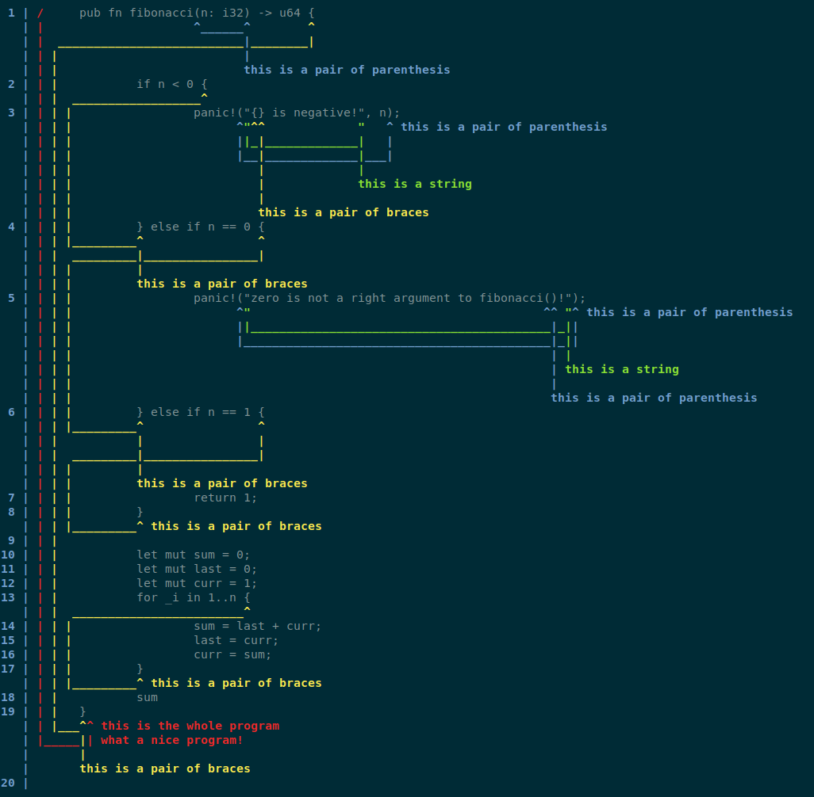

# Source Span

<table><tr>
  <td><a href="https://docs.rs/source-span">Documentation</a></td>
  <td><a href="https://crates.io/crates/source-span">Crate informations</a></td>
  <td><a href="https://github.com/timothee-haudebourg/source-span">Github</a></td>
</tr></table>

This crate provides utilities to locate characters and ranges of characters
(spans) in a source file. It also provides ways to print fragments of the source
file with span informations, hints, errors, warning and notes,
just like the `rustc` compiler.

I'm not really sure yet what is the best way to describe this crate (in
terms of keywords, categories, short description and so on). If you have betters
ideas, feel free to contact me.

## License

Licensed under either of

 * Apache License, Version 2.0 ([LICENSE-APACHE](LICENSE-APACHE) or http://www.apache.org/licenses/LICENSE-2.0)
 * MIT license ([LICENSE-MIT](LICENSE-MIT) or http://opensource.org/licenses/MIT)

at your option.

### Contribution

Unless you explicitly state otherwise, any contribution intentionally submitted
for inclusion in the work by you, as defined in the Apache-2.0 license, shall be dual licensed as above, without any
additional terms or conditions.
